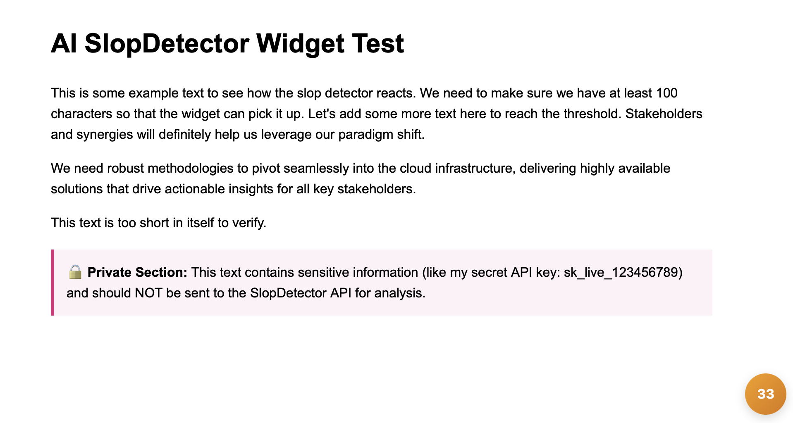
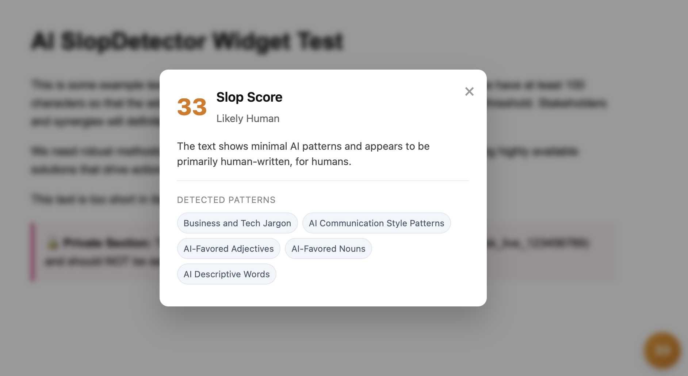

# SlopDetector Widget

The SlopDetector widget is a lightweight, embeddable JavaScript widget that plugs into any webpage. It scans the visible text on the page, analyzes it using the SlopDetector API (`https://api.slopdetector.me/api/analyze` using `https://github.com/halans/ai-pattern-detection`), and displays a "slop score" in a color-coded bubble.

The higher the score, the more likely the content is considered "slop" (e.g., AI-generated filler, business jargon, etc.). 

## Features

- **Text Extraction:** Automatically extracts up to 20,000 characters from the webpage (requires a minimum of 100 characters to run).
- **Color-coded UI:** 
  - 🟢 **Green** (Score < 20): Likely human-written.
  - 🟡 **Yellow** (Score 20-50): Some patterns detected.
  - 🔴 **Red** (Score > 50): High likelihood of slop.
- **Detailed Analysis Modal:** Clicking the bubble opens a modal displaying the exact score, classification, a short explanation, and specific patterns detected.
- **Shadow DOM Encapsulation:** The widget is fully isolated using the Shadow DOM, ensuring its styles will not conflict with or be overridden by the parent webpage's CSS.
- **Privacy Controls:** Supports `includeSelectors` and `excludeSelectors` configuration options to strictly control which parts of your webpage are sent to the API, protecting sensitive data.
- **Security (XSS Prevention):** All API responses are rigorously HTML-escaped before rendering to protect the host site against Cross-Site Scripting (XSS) vulnerabilities.





## Installation & Building

To build the distributable widget from source:

1. Clone the repository:
   ```bash
   git clone https://github.com/halans/slopdetector-widget.git
   cd slopdetector-widget
   ```

2. Install dependencies:
   ```bash
   npm install
   ```

3. Build the project using Vite:
   ```bash
   npm run build
   ```

This will generate a bundled, minified file at `dist/widget.iife.js`.

## Usage

To use the widget on your webpage, you need to include the compiled script and initialize it on a target HTML element.

1. Add a target container element anywhere in your HTML:
   ```html
   <div id="slop-widget-container" style="position: fixed; bottom: 20px; right: 20px; z-index: 9999;"></div>
   ```

2. Include the built script and initialize the widget:
   ```html
   <script src="path/to/dist/widget.iife.js"></script>
   <script>
     // Wait for the window to load, then initialize the widget on your target container
     window.addEventListener('load', () => {
       SlopDetector.init('slop-widget-container', {
         // Optional: Only analyze text inside these specific selectors
         includeSelectors: ['article', '.main-content'],
         // Optional: Exclude specific CSS selectors from being analyzed for privacy
         excludeSelectors: ['.private-data', '#user-email', '.no-slop']
       });
     });
   </script>
   ```

### Development

To run a local test page to preview changes to the widget:
```bash
npm run dev
```

**Note on CORS:** The development server is explicitly configured to run on `http://localhost:3000`. The API server (`api.slopdetector.me`) has a CORS whitelist for this specific localhost port, allowing you to fetch the actual score data during local testing without encountering Cross-Origin blocked requests. You can fork and run https://github.com/halans/ai-pattern-detection as your own API server, and update the API endpoint in the widget's `index.html` to point to your own API server.

### Testing

This project uses **Vitest** for testing the core logic, HTML escaping utilities, and privacy text exclusion features.

To run the unit tests:
```bash
npm run test
```